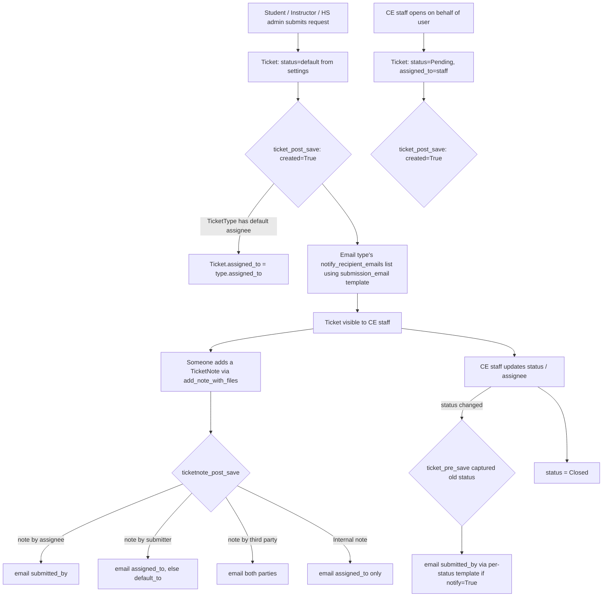

# CLAUDE.md — `support_ticket` app

Guidance for Claude Code when working in this app. `support_ticket` **is** now an editable
submodule following the same dual-package / `find_spec` pattern used by `ethos`, `invoice`, and
other feature apps. The inner Django app lives at `webapp/support_ticket/support_ticket/`; the
outer `webapp/support_ticket/` directory is the installable package root (with `setup.cfg` /
`MANIFEST.in`). Two `AppConfig` classes exist:

- **`SupportTicketConfig`** (`support_ticket.apps`) — production config, used when the package is
  pip-installed in a tenant that does not have the in-tree copy.
- **`DevSupportTicketConfig`** (`support_ticket.support_ticket.apps`) — dev config, used when the
  in-tree inner package is present.

Both configs carry `label = 'support_ticket'` so migrations, FK references, and the `app_label`
are identical in both modes. Selection is performed via
`importlib.util.find_spec('support_ticket.support_ticket')` in `myce/settings.py` (INSTALLED_APPS)
and `myce/urls.py` (URL include paths). The `submod-migration-deps` and `submod-package-manifest`
skills apply when working in this app.

## What this app does

A **support request / ticketing** system. Students, instructors, and high-school administrators
open requests; CE staff triage, assign, and respond. Each request is a `Ticket` of a configurable
`TicketType`; back-and-forth happens through `TicketNote` records; files are stored as
`TicketAttachment` rows in private S3 storage. Email notifications are driven by `signals.py` using
settings-configured templates, queued through django-mailer.

## Four portals, four URL namespaces

Each portal is gated by a role check. Index pages fetch data from scoped DRF viewsets (DataTables);
detail/create views are server-rendered and object-scoped (IDOR guards present).

| Portal | URL prefix (`myce/urls.py`) | namespace | View module | Role gate |
|--------|------------------------------|-----------|-------------|-----------|
| CE staff | `/ce/support_reqs/` | `support_ticket` | `views/tickets.py`, `views/types.py` | `user_has_cis_role` |
| Student | `/student/support_requests/` | `student_support_ticket` | `views/students.py` | `user_has_student_role` |
| HS admin | `/highschool_admin/support_requests/` | `hs_admin_support_ticket` | `views/highschool_admins.py` | `user_has_highschool_admin_role` |
| Instructor | `/instructor/support_requests/` | `instructor_support_ticket` | `views/instructors.py` | `user_has_instructor_role` |

CE staff get the full CRUD surface (list/detail/delete tickets, manage `TicketType`s, a CE-only
summary dashboard, and a CE-initiated "new request on behalf of" form). Students, instructors, and
HS admins get only list / create / detail of their own requests plus the ability to add notes.

> **Menu is currently commented out.** The nav entries for support requests are commented out in
> `cis/menu.py` (search `support_reqs` / `'support'`). The routes and views work if hit directly,
> but the feature is not surfaced in any portal's sidebar. If you're asked "why can't I see support
> tickets," this is why — re-enable the menu blocks.

## Models (`models/ticket.py`, `models/attachment.py`)

All models use UUID primary keys.

- **`TicketType`** — a category (`name`) scoped by `applies_to` (`Students`, `High School
  Administrators`, or `Instructors`), with an optional default `assigned_to` CE user. New fields
  added in the overhaul:
  - `notify_users` — M2M to `cis.CustomUser` (additional CE users to email on submission).
  - `notify_emails` — TextField of comma-separated extra addresses.
  - `requires_attachment` — BooleanField; enforced by `SupportTicketForm.clean()`.
  - `notify_recipient_emails()` — helper that merges `notify_users` emails + parsed
    `notify_emails`, de-duped, preserving order.
  - `unique_together` on `(name, applies_to)`.

- **`Ticket`** — `ticket_type`, `submitted_by`, optional `assigned_to`, `message`, `status`.
  - `status` is a plain `CharField(max_length=40, default='Submitted')` with **no `choices`
    parameter** — valid values come from the settings-configured status list at runtime.
  - `submitted_on = DateTimeField(auto_now_add=True)` — immutable creation timestamp.
  - `last_updated_on = DateTimeField(auto_now=True)` — updated on every save.
  - No `media` field (removed; replaced by `TicketAttachment`).

- **`TicketNote`** — extends the abstract `cis.models.note.Note` (`note`, `createdby`,
  `createdon`, `parent`). Adds `support_ticket` FK and `note_type` (`Public`/`Internal`). No
  `media` field (removed; replaced by `TicketAttachment`). All portals (incl. CE) create notes
  via `services.add_note_with_files(user, ticket, text, note_type, files)`, which sets
  `note_type` and persists any uploaded files as `TicketAttachment` rows. (The legacy
  `TicketNote.add_note` classmethod is unused for note creation.)

- **`TicketAttachment`** (`models/attachment.py`) — NEW model; replaces the old per-model `media`
  fields. References either a `Ticket` OR a `TicketNote` (exactly one, enforced by `clean()`).
  Fields: `ticket` FK, `note` FK, `media` (PrivateMediaStorage), `uploaded_by`, `uploaded_on`.
  Supports multiple files per ticket or note. `post_delete` signal deletes the S3 file on row
  removal.

### `submitted_by` is overloaded — read carefully

When a student/instructor/HS admin opens a ticket, `submitted_by` is them. When **CE staff** open
a ticket on someone's behalf (`add_new_support_request` view), `assigned_to` is the staff member
and `submitted_by` is the target user. The notification signal branches on this.

## Ticket lifecycle & notifications

Signals live in `signals.py` (wired via `apps.ready()`):

- **`ticket_pre_save`** (on `Ticket`) — captures `_old_status` before save; sets default status
  from settings on brand-new tickets.
- **`ticket_post_save`** (on `Ticket`) — on create: copies default assignee from type; emails the
  type's notify list using `submission_email` template. On update: if status changed, emails
  submitter using the per-status template (if `notify=True` for that status).
- **`ticketnote_post_save`** (on `TicketNote`) — emails the other party when a note is posted.
  Internal notes only notify the assignee (not the submitter).
- **`attachment_post_delete`** (on `TicketAttachment`) — deletes the S3 file on row removal.

All outgoing mail goes through `mailer.send_mail` (async django-mailer queue). The `_send()`
helper reads `is_active` from settings: `No` → skip all mail; `Debug` → redirect all recipients
to the `default_to` address list. `from_email` is settings-driven (falls back to Django's
`DEFAULT_FROM_EMAIL`). No hardcoded sender address; no hardcoded debug recipient.

## Settings

Configuration is stored via the **`setting` framework** as a `cis.models.settings.Setting` row
with key `support_ticket.settings.support_ticket_settings` (the outer/shim path — fits the 50-char
DB constraint). Edited via `/ce/settings/` — **the bespoke settings page (`forms/settings.py`) was
removed**.

The settings class is `support_ticket.support_ticket.settings.support_ticket_settings`
(class `support_ticket_settings`), registered via `CONFIGURATORS` in `apps.py`.

Configurable fields:

| Field | Purpose |
|-------|---------|
| `is_active` | `Yes` / `No` / `Debug` — controls email delivery |
| `who_can_start` | Multi-select of roles (`student`, `instructor`, `highschool_admin`) allowed to open new tickets |
| `from_email` | Sender address (falls back to `DEFAULT_FROM_EMAIL`) |
| `default_to` | Fallback recipients (comma-separated) when no assignee/notify list |
| `statuses` | Newline-separated list; first entry is the default status for new tickets |
| `submission_subject` / `submission_email` | Email sent to notify list on ticket creation |
| `note_subject` / `note_email` | Email sent when a note is added |
| `status_<slug>_notify` / `_subject` / `_email` | Per-status template fields (dynamically generated from the `statuses` list) |

Helper classmethods: `from_db()`, `get_statuses()`, `get_default_status()`, `is_active()`,
`can_start(role)`, `status_template(status)`.

`install()` is called by `register_settings` management command to seed defaults; `run_record()`
saves the form data; `preview(request, field_name)` renders a template preview.

## DRF API (DataTables backend)

All index pages are server-rendered shells; table data is fetched from scoped DRF viewsets
registered in `urls/api.py` and mounted at `/api/v1/` by `myce/urls.py`.

| Basename | ViewSet | Scope |
|----------|---------|-------|
| `support-ticket-ce` | `CETicketViewSet` | All tickets (CE-only permission) |
| `support-ticket-student` | `StudentTicketViewSet` | `submitted_by=request.user` |
| `support-ticket-instructor` | `InstructorTicketViewSet` | `submitted_by=request.user` |
| `support-ticket-hsadmin` | `HSAdminTicketViewSet` | Tickets from users in the HS admin's high schools (via `services.tickets_for_hsadmin`) |
| `support-ticket-summary` | `TicketSummaryViewSet` | Aggregated count by `group_by` param (`status`/`type`/`assignee`) — CE-only, list-only |

All viewsets annotate `attachment_count` via `Count('attachments')`. The summary viewset uses
`annotate(group=F(field))` so the grouping column is a real annotation (safe for DataTables
ordering/filtering).

Permission classes are in `permissions.py` (`IsStudent`, `IsInstructor`, `IsHSAdmin`).

## Summary dashboard

CE staff only. Template `support_ticket/ticket/summary.html` renders three Chart.js charts
(by status, by type, by assignee) fed by the `support-ticket-summary` endpoint at
`/api/v1/support-ticket-summary/?group_by=<status|type|assignee>`. Accessible at
`support_ticket:summary` (CE URL namespace).

## Reports

`ticket_types_export` — CSV export of all `TicketType` rows with columns: Name, Applies To,
Default Assignee, Notify Users, Notify Emails, Requires Attachment. Values are formula-safe via
`_csv_safe`. Registered via `REPORTS` in `apps.py`; run from `/ce/reports/`.

## Key Files

| File | Purpose |
|------|---------|
| `models/ticket.py` | `TicketType`, `Ticket`, `TicketNote` |
| `models/attachment.py` | `TicketAttachment` (string `upload_to='support_ticket/attachments/%Y/%m/'`; `clean()` enforces exactly one of ticket/note) |
| `signals.py` | All signals: assign-on-create, submission email, status-change email, note email, attachment file cleanup |
| `api.py` | DRF viewsets: `CETicketViewSet`, `StudentTicketViewSet`, `InstructorTicketViewSet`, `HSAdminTicketViewSet`, `TicketSummaryViewSet` |
| `serializers.py` | `TicketSerializer`, `TicketSummarySerializer` |
| `permissions.py` | `IsStudent`, `IsInstructor`, `IsHSAdmin` DRF permission classes |
| `services.py` | `create_ticket_with_files`, `add_note_with_files`, `tickets_for_hsadmin` |
| `constants.py` | `ROLE_TO_APPLIES_TO`, `APPLIES_TO_TO_ROLE`, `DEFAULT_STATUSES` |
| `settings/support_ticket_settings.py` | `support_ticket_settings` settings class + helper classmethods |
| `reports/ticket_types_export.py` | `ticket_types_export` CSV report |
| `views/tickets.py` | CE: list / detail / delete / summary / on-behalf-of create |
| `views/types.py` | CE: `TicketType` CRUD |
| `views/students.py` | Student portal: list / create / detail+notes |
| `views/highschool_admins.py` | HS admin portal: list / create / detail+notes |
| `views/instructors.py` | Instructor portal: list / create / detail+notes |
| `forms/types.py` | `SupportTicketForm`, `SupportTicketAssignmentForm`, `SupportTicketNoteForm`, `NewSupportTicketForm` |
| `urls/api.py` | DRF router: all five viewset basenames |
| `urls/{ce,student,highschool_admin,instructor}.py` | One URLconf per portal namespace |
| `templates/support_ticket/{ticket,type,student,highschool_admin,instructor}/` | Per-portal templates |

## Gotchas / known issues

| Issue | Detail |
|-------|--------|
| **CE on-behalf AJAX uses `$.serialize()`** | The "add new request on behalf of" modal in the CE portal uses jQuery's `$.serialize()` to POST form data, which does not include file inputs. If file upload from the CE on-behalf UI is ever needed, the JS must be updated to use `FormData` instead. |
| **Emails are async (django-mailer)** | `send_mail` enqueues via django-mailer — emails are not sent immediately in the request cycle. The `send_queued_mail` management command (or a cron job) drains the queue. |

## Conventions when editing here

- Match the existing per-portal view structure — one module per role, role-gated with
  `@user_passes_test(user_has_*_role, login_url='/')`, rendering `support_ticket/<portal>/<page>.html`.
- DataTables index pages render a shell template that POSTs to `/api/v1/support-ticket-<role>/?format=datatables`.
- Settings access: always use `STS.from_db()` / `STS.can_start(role)` / `STS.get_statuses()` etc.
  (classmethods on `support_ticket_settings`). Do not read the `Setting` model directly.
- Menu state is drawn with `draw_menu(cis_menu / STUDENT_MENU / HS_ADMIN_MENU / INSTRUCTOR_MENU, …)`;
  keep the `support_reqs` / `support` keys consistent if you re-enable the nav.
- Migrations live in the **inner** package (`support_ticket/support_ticket/migrations/`); make them
  with `docker exec -w /app/webapp django_web_ewu python manage.py makemigrations support_ticket`.
  The `submod-migration-deps` skill applies when this app is later extracted and shared across
  tenants.

### Proxy-shim maintenance rule

The editable-dev layout includes outer proxy shim modules under
`webapp/support_ticket/{models,forms,views}/` that re-export symbols from the inner package
(`support_ticket.support_ticket.*`). These shims exist so that any code that imports via the
top-level `support_ticket.X` path continues to work in dev mode (where the outer package is on
`sys.path` but the Django app is the inner one).

**When you add a new inner module** that:

- other inner code imports via the `support_ticket.<module>` path (not
  `support_ticket.support_ticket.<module>`), **or**
- `myce/urls.py` `include()`s by a string path rooted at `support_ticket.`,

you **must** add a matching outer shim file (e.g. `webapp/support_ticket/newmodule.py` that
re-exports from `support_ticket.support_ticket.newmodule`). Production is unaffected — in prod the
inner package IS `support_ticket` — but omitting the shim breaks dev-mode imports.

## Extracting to its own repo (final mechanical step — do when ready to ship to other tenants)

1. Create `Canusia/package-support_ticket` on GitHub.
2. Copy the entire `webapp/support_ticket/` directory (outer package incl. inner) into the new repo root.
3. Tag a release: `git tag v0.0.1 && git push --tags`.
4. In each consuming tenant's `webapp/requirements.txt` add:
   `git+https://github.com/Canusia/package-support_ticket.git@v0.0.1`
5. Tenants WITHOUT the in-tree copy load the prod `SupportTicketConfig`; EWU keeps the in-tree copy
   and loads `DevSupportTicketConfig` via find_spec. Both use app label `support_ticket`.
