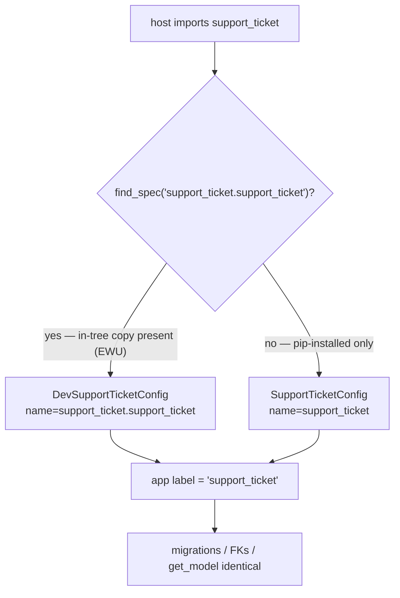
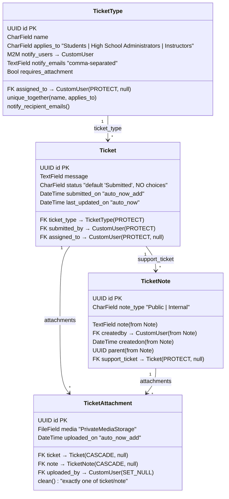
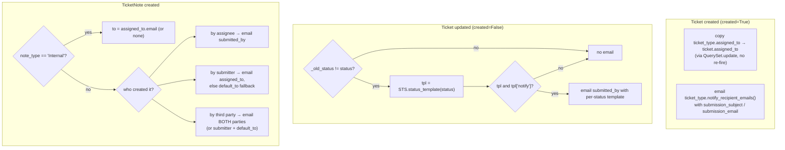
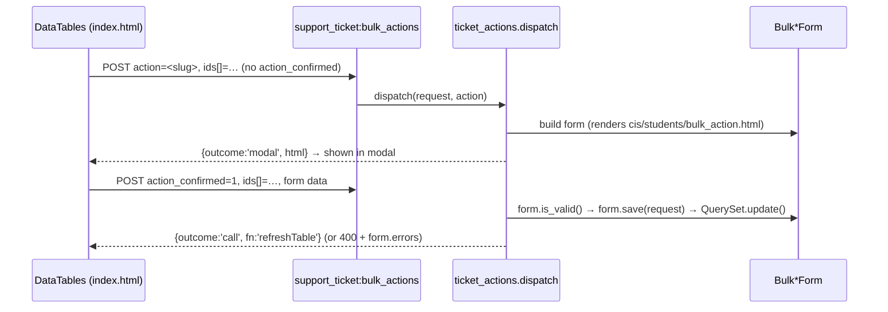

# `support_ticket` — Technical / Architecture Reference

Deep-dive companion to the [README](../README.md). The README covers installation and
wiring; this document explains *how the package is built and why*, for a developer
maintaining or extending `Canusia/package-support_ticket`.

`support_ticket` is a configurable **support-request / ticketing** system for the MyCE
(My Concurrent Enrollment) platform. Students, instructors, and high-school administrators
open requests; CE (Concurrent Enrollment) staff triage, assign, respond, and report. It
ships as a pip-installable Django app that also supports an in-tree *editable* layout in
the EWU host repo.

> Path conventions in this doc: the **package root** is `webapp/support_ticket/` (outer);
> the **Django app** is the inner package `webapp/support_ticket/support_ticket/`. In a
> pip-installed tenant there is only one level (`support_ticket/`), which corresponds to
> the inner package here.

---

## Table of contents

1. [Architecture & the dual-package pattern](#1-architecture--the-dual-package-pattern)
2. [Data model](#2-data-model)
3. [Ticket lifecycle & signals](#3-ticket-lifecycle--signals)
4. [Settings framework integration](#4-settings-framework-integration)
5. [DRF API & scoping](#5-drf-api--scoping)
6. [Submission, uploads & role gating](#6-submission-uploads--role-gating)
7. [CE workflow tooling](#7-ce-workflow-tooling)
8. [Reports & summary dashboard](#8-reports--summary-dashboard)
9. [Migrations notes](#9-migrations-notes)
10. [Extending the app](#10-extending-the-app)

---

## 1. Architecture & the dual-package pattern

The app follows the same **outer-proxy + inner-app** convention used by `ethos`,
`invoice`, `future_sections`, etc. The outer directory is the installable package; the
inner directory is the actual Django app.

```
webapp/support_ticket/                 ← OUTER package root (setup.cfg, pyproject.toml, MANIFEST.in)
├── __init__.py                        ← NO Django imports (loaded before app registry)
├── api.py, actions.py, constants.py … ← OUTER PROXY SHIMS: `from support_ticket.support_ticket.X import *`
├── models/, forms/, views/, settings/, reports/  ← more shims
└── support_ticket/                    ← INNER Django app (the real code)
    ├── apps.py                        ← SupportTicketConfig / DevSupportTicketConfig
    ├── models/ signals.py services.py api.py serializers.py permissions.py
    ├── settings/ forms/ views/ urls/ reports/ actions.py constants.py
    ├── migrations/ templates/ staticfiles/ tests/
```

### Two AppConfigs, one label

`support_ticket/support_ticket/apps.py` defines both configs. The dev config subclasses
the prod one, overriding only `name`/`verbose_name` and the dotted paths inside
`CONFIGURATORS`/`REPORTS`:

| Config | Used when | `name` | `label` | `ready()` imports |
|--------|-----------|--------|---------|-------------------|
| `SupportTicketConfig` (prod) | package pip-installed, no in-tree copy | `support_ticket` | `support_ticket` | `support_ticket.signals` |
| `DevSupportTicketConfig` (dev) | in-tree inner package present | `support_ticket.support_ticket` | `support_ticket` | `support_ticket.support_ticket.signals` |

Both carry **`label = 'support_ticket'`**, so `app_label`, FK references
(`'support_ticket.ticket'`), migration state, and `apps.get_model('support_ticket', …)`
are identical in both modes. This is what lets the *same* migration files run in both
layouts.

### `find_spec` selection in the host

The host (`webapp/myce/`) chooses the config and URL paths at import time:

```python
# myce/settings.py — INSTALLED_APPS
'support_ticket.support_ticket.apps.DevSupportTicketConfig'
if importlib.util.find_spec('support_ticket.support_ticket')
else 'support_ticket.apps.SupportTicketConfig',
```

```python
# myce/settings.py — STATICFILES_DIRS
os.path.join(get_package_path("support_ticket.support_ticket"), 'staticfiles')
if importlib.util.find_spec('support_ticket.support_ticket')
else os.path.join(get_package_path("support_ticket"), 'staticfiles')
if get_package_path("support_ticket") else None,
```

```python
# myce/urls.py — URL includes
if importlib.util.find_spec('support_ticket.support_ticket'):
    urlpatterns += [ path('ce/support_reqs/', include('support_ticket.support_ticket.urls.ce')), … ]
else:
    urlpatterns += [ path('ce/support_reqs/', include('support_ticket.urls.ce')), … ]
```



### The proxy-shim maintenance rule — READ THIS BEFORE ADDING MODULES

In dev mode the **outer** `support_ticket` package is on `sys.path`, but the Django app is
the **inner** `support_ticket.support_ticket`. Any code (or `urls.include()` string) that
resolves a symbol via the top-level `support_ticket.<module>` path will hit the *outer*
package first. The outer package therefore contains thin re-export shims, e.g.:

```python
# webapp/support_ticket/api.py
from support_ticket.support_ticket.api import *  # noqa: F401, F403
```

```python
# webapp/support_ticket/models/ticket.py
from support_ticket.support_ticket.models.ticket import *           # noqa: F401,F403
from support_ticket.support_ticket.models.ticket import TicketType, Ticket, TicketNote
```

> **Rule:** when you add a new inner module that is imported via the top-level
> `support_ticket.<module>` path **or** `include()`d by a `support_ticket.…` string in
> `urls.py`, you **must** add a matching outer shim file. Omitting it raises
> `ModuleNotFoundError` only in **pip-installed** mode (where the outer shims become the
> real package) — dev mode may appear to work, masking the bug. Production has no inner
> level, so the shim *is* the module there.

**Existing outer shims** (all `from support_ticket.support_ticket.… import *`):

| Outer file | Re-exports inner |
|------------|------------------|
| `api.py` | `api` |
| `actions.py` | `actions` |
| `constants.py` | `constants` |
| `permissions.py` | `permissions` |
| `serializers.py` | `serializers` |
| `services.py` | `services` |
| `models/__init__.py`, `models/ticket.py`, `models/attachment.py` | `models` package |
| `forms/__init__.py`, `forms/types.py`, `forms/bulk.py`, `forms/fields.py` | `forms` package |
| `views/__init__.py`, `views/tickets.py`, `views/types.py`, `views/students.py`, `views/instructors.py`, `views/highschool_admins.py` | `views` package |
| `settings/support_ticket_settings.py` | `settings` package |
| `reports/ticket_types_export.py` | `reports` package |

Note there is **no outer `apps.py`, `signals.py`, `admin.py`, or `urls/`** — those are
referenced only through the inner path (the host's `urls.py`/`settings.py` already branch
on `find_spec`, and `signals` is imported by `apps.ready()` using the config-specific
dotted path). The outer `__init__.py` deliberately imports **no** Django code, because it
loads before the app registry is ready.

> `setup.cfg` excludes the dev-only shim packages from the built wheel
> (`[options.packages.find] exclude = tests*, forms, forms.*, models, models.*, views,
> views.*`) — in a pip install the inner package supplies these directly.

---

## 2. Data model

Four models, all with **UUID primary keys** (`uuid.uuid4`, `editable=False`).
`TicketType`/`Ticket`/`TicketNote` live in `models/ticket.py`; `TicketAttachment` lives in
`models/attachment.py`. All are re-exported through `models/__init__.py`.



### `TicketType`

A category, scoped by `applies_to` to one role audience. Key behaviour:

- `applies_to` choices: `Students`, `High School Administrators`, `Instructors`
  (constants `STUDENTS`/`SCHOOL_ADMINS`/`INSTRUCTORS`).
- `assigned_to` — optional default CE assignee, copied onto new tickets by the create signal.
- `notify_users` (M2M) + `notify_emails` (comma-separated text) — extra submission recipients.
- `requires_attachment` — enforced at form level by `SupportTicketForm.clean()`, *not* by a DB constraint.
- `unique_together = ['name', 'applies_to']`.
- `notify_recipient_emails()` merges `notify_users` emails with parsed `notify_emails`,
  de-duped and **order-preserving** (first occurrence wins).

### `Ticket`

- **`status = CharField(max_length=40, default='Submitted')` with NO `choices`.** Valid
  values are sourced at runtime from the settings status list
  (`support_ticket_settings.get_statuses()`). This is deliberate — statuses are
  tenant-configurable, so baking `choices` into the model would force a migration on every
  status change. Forms/serializers/filters constrain the value, not the field.
- `submitted_by` is **overloaded**: normally the requester, but when CE staff open a
  ticket *on behalf of* someone (`add_new_support_request`), `submitted_by` is the target
  user and `assigned_to` is the staff member. Signals branch on the relationship between
  `createdby` and these two FKs.
- `submitted_on = auto_now_add` (immutable creation time); `last_updated_on = auto_now`
  (touched on every save). These semantics were corrected in migration `0006` (see §9).

### `TicketNote`

Extends the abstract `cis.models.note.Note` (fields `note`, `createdby`, `createdon`,
`parent`). Adds `support_ticket` FK and `note_type` (`Public`/`Internal`). Notes are
created through `services.add_note_with_files(...)`, **not** the legacy `TicketNote.add_note`
classmethod (which remains for backward compatibility but is unused by current views).
`Internal` notes are visible only to CE staff (submitter portals filter `note_type='Public'`).

### `TicketAttachment`

Replaces the old per-model `media` fields. References **exactly one** of `ticket` or
`note`, enforced by `clean()`:

```python
def clean(self):
    if bool(self.ticket_id) == bool(self.note_id):
        raise ValidationError(
            'A TicketAttachment must reference exactly one of ticket or note.')
```

> `clean()` is **not** auto-run on `.create()`; the service helpers always set exactly one
> FK, so the invariant holds in practice. Call `full_clean()` if you build attachments
> through new code paths.

`media` uses `PrivateMediaStorage` (S3, private ACL) with a **string** `upload_to`
(`'support_ticket/attachments/%Y/%m/'`, `max_length=500`). See §6 for *why a string and
not a callable*. A `post_delete` signal removes the underlying S3 object (§3).

---

## 3. Ticket lifecycle & signals

All signals are in `signals.py`, wired by `apps.ready()` via an **unconditional** import
(so any error inside the module surfaces loudly instead of being swallowed). Email is
**asynchronous** — every send goes through `mailer.send_mail` (django-mailer), which
*enqueues* a row; the `send_queued_mail` management command / cron drains the queue.

### Email plumbing

```python
def _send(subject, body, recipients):
    cfg = STS.from_db()
    if cfg.get('is_active', 'Yes') == 'No':      # global kill switch → send nothing
        return
    recipients = _resolve_recipients(recipients) # Debug → redirect to default_to
    if not recipients:
        return
    from_email = cfg.get('from_email') or None   # None → Django DEFAULT_FROM_EMAIL
    send_mail(subject, body, from_email, recipients, fail_silently=True)
```

- `is_active == 'No'` → no mail at all.
- `is_active == 'Debug'` → `_resolve_recipients` redirects **all** mail to the
  `default_to` address list (safe for staging).
- No hardcoded sender or debug recipient — both are settings-driven.
- Bodies are rendered with Django's template engine (`Template(...).render(Context(...))`)
  using shortcodes from the settings templates.

### The four signal receivers



**`ticket_pre_save`** — `Ticket` uses a `uuid4` default PK, so `instance.pk` is already
populated on an unsaved row; `instance._state.adding` is the reliable "is this an insert"
test. On insert: stash `_old_status = None` and default `status` from settings if blank.
On update: capture `_old_status` from the DB row.

```python
if not instance._state.adding:
    instance._old_status = Ticket.objects.get(pk=instance.pk).status
else:
    instance._old_status = None
    if not instance.status:
        instance.status = STS.get_default_status()
```

**`ticket_post_save`** —
- *created*: copy `ticket_type.assigned_to` onto the ticket using
  `Ticket.objects.filter(pk=...).update(...)` (a bare `.update()` deliberately **bypasses**
  the signals to avoid an email loop), then email the type's notify list with the
  `submission_email` template.
- *updated*: if `_old_status != status`, look up the per-status template; if it exists and
  `notify` is true, email `submitted_by` with that status's subject/body.

**`ticketnote_post_save`** — emails the **other** party so the conversation pings the
counterpart. The `default_to` settings list is the fallback recipient when a ticket has no
assignee. `Internal` notes never notify the submitter — they go only to `assigned_to` (or
nobody if unassigned).

**`attachment_post_delete`** — `instance.media.delete(save=False)` removes the S3 object
when a `TicketAttachment` row is deleted (e.g. via `Ticket`/`TicketNote` CASCADE).

> **Bulk operations bypass these signals on purpose** — `forms/bulk.py` and the CE
> on-behalf flow use `QuerySet.update()`, which never fires `pre_save`/`post_save`. This
> prevents an "email storm" when reassigning or re-statusing many tickets at once. Single
> changes through the detail page go through `.save()` and *do* notify. See §7.

---

## 4. Settings framework integration

Configuration is one `cis.models.settings.Setting` row, managed through the host's
`setting` framework (CE → Settings UI). The class is
`support_ticket.support_ticket.settings.support_ticket_settings.support_ticket_settings`
(subclasses `SettingForm`), registered through `CONFIGURATORS` in `apps.py`.

### The 48-char key constraint

```python
class support_ticket_settings(SettingForm):
    key = 'support_ticket.settings.support_ticket_settings'   # 48 chars
```

`Setting.key` is `max_length=50`. The **inner** dotted path
(`support_ticket.support_ticket.settings.support_ticket_settings`) is 63 chars and would
overflow. The **outer/shim** path is 48 chars and resolvable via `import_string` in both
dev and prod (the outer shim re-exports the class). This is why the key uses the shim path.

### Static fields (defined on `SettingForm`)

| Field | Purpose |
|-------|---------|
| `is_active` | `Yes` / `No` / `Debug` — email delivery mode (see §3) |
| `who_can_start` | multi-select of roles (`student`, `instructor`, `highschool_admin`) allowed to open tickets |
| `from_email` | sender address; blank → `DEFAULT_FROM_EMAIL` |
| `default_to` | fallback recipients (comma-separated) when no assignee / notify list |
| `statuses` | newline-separated; **first line is the default status** for new tickets |
| `submission_subject` / `submission_email` | sent to the type's notify list on creation. Shortcodes: `{{first_name}} {{ticket_type}} {{message}} {{site_url}}` |
| `note_subject` / `note_email` | sent when a note is added. Shortcodes: `{{update}} {{site_url}}` |

Email-body fields run through `validate_html_short_code` (a `cis` validator) so unknown
shortcodes are rejected at save time.

### Dynamically generated per-status fields

`__init__` reads the saved status list and adds three fields **per status** (slugified):

```python
for status in self.get_statuses():
    slug = slugify(status)
    self.fields[f'status_{slug}_notify']  = forms.BooleanField(required=False, …)
    self.fields[f'status_{slug}_subject'] = forms.CharField(required=False, …)
    self.fields[f'status_{slug}_email']   = forms.CharField(widget=Textarea, validators=[validate_html_short_code], …)
```

So adding a line to `statuses` and re-saving surfaces a new notify/subject/email block on
the next render. Per-status shortcodes: `{{first_name}} {{status}} {{ticket_type}} {{site_url}}`.

### Helper API (classmethods — call these, never read `Setting` directly)

| Method | Returns |
|--------|---------|
| `from_db()` | the stored `value` dict (or `{}`) |
| `get_statuses()` | list from `statuses` text, or `DEFAULT_STATUSES` if unset |
| `get_default_status()` | `get_statuses()[0]` |
| `is_active()` | `'Yes'` (default) / `'No'` / `'Debug'` |
| `can_start(role)` | `True` if role in `who_can_start`; **unconfigured → permissive `True`** |
| `status_template(status)` | `{notify, subject, email}` dict, or `None` if no template configured for that status |

### Lifecycle hooks (called by the framework)

- `install()` — seeds defaults; invoked by the `register_settings` management command.
  Default `statuses = '\n'.join(DEFAULT_STATUSES)` (`Submitted/Pending/Closed`), default
  `who_can_start = ['student','instructor','highschool_admin']`.
- `run_record()` — serializes the form (static + dynamic per-status fields) and saves the
  `Setting`; returns a JSON success response.
- `preview(request, field_name)` — renders a template body with sample context into
  `cis/email.html`.

### Legacy-key data migration (`0007`)

Earlier code stored the row under the bare key `support_ticket_settings`. Migration
`0007_migrate_legacy_settings_key` copies that into the new 48-char key and **remaps**
`email_subject → note_subject` (signals read `note_subject`):

```python
OLD_KEY = 'support_ticket_settings'
NEW_KEY = 'support_ticket.settings.support_ticket_settings'
# … copy old.value → new.value, then:
if old.value and 'email_subject' in old.value and 'note_subject' not in new.value:
    new.value['note_subject'] = old.value['email_subject']
```

Idempotent and no-ops cleanly when the legacy row is absent.

---

## 5. DRF API & scoping

All index pages are server-rendered shells; the table rows come from scoped DRF viewsets
(`api.py`) registered in `urls/api.py` and mounted at `/api/v1/` by the host. They use
`rest_framework_datatables` (request the endpoint with `?format=datatables`).

Shared base query (select_related + attachment count):

```python
def _base_qs():
    return Ticket.objects.select_related('ticket_type','submitted_by','assigned_to') \
                         .annotate(attachment_count=Count('attachments'))
```

### Endpoint → permission → scope

| Basename | ViewSet | Permission | Scope |
|----------|---------|-----------|-------|
| `support-ticket-ce` | `CETicketViewSet` | `CIS_user_only` | **all** tickets; optional `?status=` and `?assigned_to=` (`unassigned` or a CE user id) filters |
| `support-ticket-student` | `StudentTicketViewSet` | `IsStudent` | `submitted_by = request.user` |
| `support-ticket-instructor` | `InstructorTicketViewSet` | `IsInstructor` | `submitted_by = request.user` |
| `support-ticket-hsadmin` | `HSAdminTicketViewSet` | `IsHSAdmin` | tickets from users in the admin's high schools, via `services.tickets_for_hsadmin` |
| `support-ticket-summary` | `TicketSummaryViewSet` | `CIS_user_only` | list-only aggregate `count` grouped by `?group_by=status\|type\|assignee` |

Permission classes (`permissions.py`) wrap the `cis` role checks; `CIS_user_only` comes
from `cis.utils`. `IsStudent`/`IsInstructor`/`IsHSAdmin` subclass a small `_RolePermission`
that requires `is_authenticated` **and** the role check.

`tickets_for_hsadmin(user)` (`services.py`) is the **single source of truth** for HS-admin
scoping — used by both the viewset and the HS-admin detail view, so the list and the
detail page can never disagree. It collects student user-ids and HS-admin user-ids for the
admin's high schools and filters `submitted_by_id__in`.

### LoginRequiredMiddleware allowlist requirement

The host's `cis.middleware.LoginRequiredMiddleware` force-applies `login_required` to every
view by `view_func.__name__` unless the name is in an allowlist. DRF viewsets must be in
that allowlist or they get redirected/wrapped before DRF's own permission classes run.
All five are listed:

```python
# cis/middleware.py
'CETicketViewSet', 'StudentTicketViewSet', 'InstructorTicketViewSet',
'HSAdminTicketViewSet', 'TicketSummaryViewSet',
```

> **When you add a viewset, add its class name here**, or the endpoint will not behave as
> a DRF-authenticated API. (This is host-side wiring, not shipped in the package.)

### Summary viewset — the annotation-grouping gotcha

DataTables ordering/searching operate on serializer fields that must map to real ORM
columns. The summary viewset exposes the grouping column as a **real annotation** named
`group`, not a `SerializerMethodField`:

```python
return (Ticket.objects
        .annotate(group=F(field))      # field ∈ {status, ticket_type__name, assigned_to__last_name}
        .values('group')
        .annotate(count=Count('id'))
        .order_by('group'))
```

If `group` were a `SerializerMethodField`, DataTables ordering/filtering on it would 500
with a `FieldError` (no such DB column). `TicketSummarySerializer.get_group` only converts
a null group to the label `'Unassigned'`.

### Serializer

`TicketSerializer` (`serializers.py`) is read-only and DataTables-shaped:
`ticket_type_name`, `submitter_name`/`submitter_email`, `assignee_name`, `status`,
`submitted_on`/`last_updated_on` (formatted `%m/%d/%Y`), `attachment_count`, and a
context-driven `detail_url`. `detail_url` reverses `portal_detail_urlname` (set per viewset)
and returns `''` on `NoReverseMatch` so an unwired portal namespace degrades gracefully.
`datatables_always_serialize = ['id','detail_url']` keeps those columns present regardless
of DataTables column selection.

---

## 6. Submission, uploads & role gating

### Multi-file uploads

`forms/fields.py` provides the multi-file primitive (Django's `FileField` is single-file):

```python
class MultipleFileInput(forms.ClearableFileInput):
    allow_multiple_selected = True

class MultipleFileField(forms.FileField):
    # clean() returns a LIST of cleaned files (or [] when empty)
```

`SupportTicketForm`, `SupportTicketNoteForm`, and `NewSupportTicketForm` all expose a
`files = MultipleFileField(required=False)`.

### Atomic create/add helpers (`services.py`)

```python
@transaction.atomic
def create_ticket_with_files(user, ticket_type, message, files):
    ticket = Ticket.objects.create(ticket_type=ticket_type, submitted_by=user, message=message)
    for f in files or []:
        TicketAttachment.objects.create(ticket=ticket, media=f, uploaded_by=user)
    return ticket

@transaction.atomic
def add_note_with_files(user, ticket, note_text, note_type, files):
    note = TicketNote.objects.create(support_ticket=ticket, createdby=user, note=note_text, note_type=note_type)
    for f in files or []:
        TicketAttachment.objects.create(note=note, media=f, uploaded_by=user)
    return note
```

Both wrap the row + attachments in one transaction. `Ticket.objects.create` triggers the
create signal (assignee copy + submission email); `TicketNote.objects.create` triggers the
note signal. **All portals (including CE) create notes through `add_note_with_files`.**

### Role-filtered ticket types

`SupportTicketForm.__init__(role=...)` filters the `ticket_type` queryset to the type
audience for that role via `constants.ROLE_TO_APPLIES_TO`:

```python
ROLE_TO_APPLIES_TO = {
    'student': 'Students',
    'highschool_admin': 'High School Administrators',
    'instructor': 'Instructors',
}
APPLIES_TO_TO_ROLE = {v: k for k, v in ROLE_TO_APPLIES_TO.items()}
```

So a student only ever sees `applies_to='Students'` types, etc. The CE on-behalf form
(`NewSupportTicketForm`) supports only `Students` and `School Administrators` (instructors
file their own).

### `requires_attachment` enforcement

Enforced in the form, not the DB:

```python
def clean(self):
    cleaned = super().clean()
    ticket_type = cleaned.get('ticket_type')
    files = cleaned.get('files') or []
    if ticket_type and ticket_type.requires_attachment and not files:
        self.add_error('files', 'This request type requires at least one attachment.')
    return cleaned
```

### `who_can_start` gating

Each submitter portal's `add_new` view checks `STS.can_start(role)` up front and the index
template hides the "new request" button via the `can_start` context flag. Unconfigured
settings → permissive (matches pre-feature behaviour).

### Why `upload_to` is a **string**, not a callable

`TicketAttachment.media` uses `upload_to='support_ticket/attachments/%Y/%m/'`. A callable
`upload_to` is serialized into migrations by its **fully-qualified dotted path**, which
differs between dev (`support_ticket.support_ticket.models...`) and prod
(`support_ticket.models...`) because `__module__` differs between the two layouts. That
would make the frozen migration non-portable across tenants (and would even differ between
the same tenant's dev/prod). A string `upload_to` (with strftime tokens) serializes
identically in both modes, so the migration is portable. This is the same reasoning that
keeps the inner module path out of frozen migrations (§9).

---

## 7. CE workflow tooling

### DataTables export + filters

The CE index (`templates/support_ticket/ticket/index.html`) uses
`dom: 'lBfrtip'` with **CSV** and **pdfHtml5** export buttons
(`exportOptions: { columns: ':not(:first-child):not(:last-child)' }` strips the checkbox
and action columns). Two server-side filters feed the AJAX request:

```js
data: function (d) {
    d.status = $('#filter_status').val();        // → ?status=
    d.assigned_to = $('#filter_assigned').val(); // → ?assigned_to=  (id or 'unassigned')
}
```

These map to the `CETicketViewSet.get_queryset` filters (§5). `assigned_to` is parsed with
`int(...)` and returns `qs.none()` on a bad value (no 500 on garbage input).

### Bulk actions via `ActionRegistry`

`actions.py` instantiates a local `myce.component_registry.ActionRegistry` and registers
two **two-phase** (`method='form'`) handlers:

```python
ticket_actions = ActionRegistry(OrderedDict({'bulk_ticket': {'actions': OrderedDict()}}))

@ticket_actions.action('bulk_ticket', label='Update Status', scope=['bulk'],
                       slug='bulk_update_status', method='form', …)
def bulk_update_status(request): …

@ticket_actions.action('bulk_ticket', label='Update Assigned To', scope=['bulk'],
                       slug='bulk_update_assigned_to', method='form', …)
def bulk_update_assigned_to(request): …
```



- Phase 1 (no `action_confirmed`): render the form inside the shared
  `cis/students/bulk_action.html` modal, return `{outcome:'modal', html}`.
- Phase 2 (`action_confirmed=1`): validate, `form.save(request)`, return
  `{outcome:'call', fn:'refreshTable'}` or a `400` with `form.errors.as_json()`.
- The index JS calls `window.ActionRegistry.doBulkAction(url, slug, dt)`.
- Dispatch entry point is the CE view `support_ticket_bulk_actions` →
  `ticket_actions.dispatch(request, request.POST.get('action'))`, at URL name
  `support_ticket:bulk_actions`.

`forms/bulk.py` guards the incoming ids with `_valid_uuids()` (drops anything that isn't a
valid UUID) before the `.update()`, and **intentionally uses `QuerySet.update()`** to skip
signals/emails on bulk (see the module docstring and §3). `BulkTicketStatusForm` sources
its choices from `STS.get_statuses()`; `BulkTicketAssignForm` limits the queryset to active
`ce`-group users.

### Open-in-modal (record-details + global `#details` iframe)

The action column renders `<a class="record-details" refresh-target="table" href="<detail_url>">Open</a>`.
The host's global JS opens `record-details` links inside the shared `#details` iframe
modal. The CE detail/type views are decorated `@xframe_options_exempt` so they can render
inside that iframe.

---

## 8. Reports & summary dashboard

### `ticket_types_export` report

`reports/ticket_types_export.py` is a `forms.Form` with a `run(task, data)` method,
registered via `REPORTS` in `apps.py` (`available_for: ['ce']`, category `4`) and run from
CE → Reports. It writes a CSV of all `TicketType` rows to `PrivateMediaStorage` and returns
the URL:

```python
HEADER = ['Name','Applies To','Default Assignee','Notify Users','Notify Emails','Requires Attachment']

def run(self, task, data):
    stream = io.StringIO(); writer = csv.writer(stream)
    for row in self.get_rows(): writer.writerow(row)
    path = f"reports/{task.id}/ticket-types-export.csv"
    storage = PrivateMediaStorage()
    path = storage.save(path, ContentFile(stream.getvalue().encode('utf-8')))
    return storage.url(path)
```

Every cell goes through `_csv_safe` (from `myce_tenant_configs.services.bulk_enroller`) to
neutralize CSV formula injection (a leading `=`/`+`/`-`/`@`). The form helper posts to
`report:run_report` with the `report_id`.

### CE summary dashboard

CE-only, at URL name `support_ticket:summary`, template
`templates/support_ticket/ticket/summary.html`. It draws three **Chart.js** charts from the
`support-ticket-summary` endpoint:

```js
$.getJSON(base + '?group_by=' + groupBy + '&format=datatables&length=1000', …)
draw('chart_status',   'status',   'doughnut');
draw('chart_type',     'type',     'bar');
draw('chart_assignee', 'assignee', 'bar');
```

Chart.js ships **with the package** (`staticfiles/support_ticket/js/chart.umd.min.js`) — no
CDN dependency. `group_by` maps through `TicketSummaryViewSet.GROUP_FIELDS`
(`status`→`status`, `type`→`ticket_type__name`, `assignee`→`assigned_to__last_name`).

---

## 9. Migrations notes

Chain `0001`–`0008`, all in the **inner** package
(`support_ticket/support_ticket/migrations/`). Make new ones with:

```bash
docker exec -w /app/webapp django_web_ewu python manage.py makemigrations support_ticket
```

| # | What it does |
|---|--------------|
| `0001_initial` | creates `Ticket` (with old `media`, choice-based `status`), `TicketType`, `TicketNote` |
| `0002_type_notify_and_requires_attachment` | adds `notify_users`/`notify_emails`/`requires_attachment`; adds `Instructors` to `applies_to` choices |
| `0003_add_ticket_attachment` | creates `TicketAttachment` |
| `0004_migrate_media_to_attachment` | **data**: copies `Ticket.media`/`TicketNote.media` into `TicketAttachment` rows |
| `0005_drop_media_fields` | removes the old `media` fields from `Ticket`/`TicketNote` |
| `0006_fix_ticket_dates_and_status` | `status` → drop `choices`, widen to 40; `submitted_on` → `auto_now_add`; `last_updated_on` → `auto_now` |
| `0007_migrate_legacy_settings_key` | **data**: re-key the settings row + remap `email_subject`→`note_subject` (§4) |
| `0008_alter_ticketattachment_media` | normalizes `media` to the string `upload_to` + `max_length=500` |

### Tenant portability

Cross-app dependencies on `cis` use **`('cis', '__first__')`**, never a pinned migration
number — different tenants are at different `cis` migration heights, so a pinned number
would fail to apply elsewhere. (The `submod-migration-deps` skill enforces this when new
migrations are generated.) Example, `0004`:

```python
dependencies = [
    ('support_ticket', '0003_add_ticket_attachment'),
    ('cis', '__first__'),
]
```

### Frozen migrations must not import the inner module path

`0001` inlines copies of the old `upload_to` callables rather than importing the live
module:

```python
# Inline copies kept so this frozen migration does not import the live module.
def _ticket_upload_path(instance, filename):
    return f"ticket/{instance.id}/{filename}"
```

Importing `support_ticket.support_ticket.models...` from a migration would break in
pip-installed mode (no inner level) and pin the migration to one layout. For the **current**
`TicketAttachment.media`, the string `upload_to` sidesteps this entirely (§6) — that's the
purpose of `0008`. Keep migrations self-contained: inline helpers, string `upload_to`, and
`('cis','__first__')` deps.

### The media → attachment data move (`0004`)

```python
for ticket in Ticket.objects.exclude(media='').exclude(media=None):
    TicketAttachment.objects.create(ticket_id=ticket.id, media=ticket.media,
                                    uploaded_by_id=ticket.submitted_by_id)
for note in TicketNote.objects.exclude(media='').exclude(media=None):
    TicketAttachment.objects.create(note_id=note.id, media=note.media,
                                    uploaded_by_id=getattr(note, 'createdby_id', None))
```

Reverse is a deliberate no-op (irreversible data move; the attachment rows are retained).
Uses `apps.get_model('support_ticket', …)` against the historical state, which resolves
correctly because both AppConfigs share `label='support_ticket'`.

---

## 10. Extending the app

A checklist for the common changes, pointing at the relevant seams.

### Add a new portal (role)

1. Add the role → audience mapping in `constants.ROLE_TO_APPLIES_TO`.
2. Add a `views/<role>s.py` module (copy `views/students.py`): `tickets`/`add_new`/`details`,
   each `@user_passes_test(user_has_<role>_role, login_url='/')`, scoping `details` with an
   IDOR guard (`get_object_or_404(..., submitted_by=request.user)` or a service scope fn).
3. Add a DRF viewset in `api.py` + a permission class in `permissions.py`; register a
   `support-ticket-<role>` basename in `urls/api.py`; set its `portal_detail_urlname`.
4. **Add the viewset class name to the host's `cis.middleware.LoginRequiredMiddleware`
   allowlist** (§5).
5. Add a `urls/<role>.py` URLconf (`app_name='<role>_support_ticket'`) and `include()` it
   in the host `myce/urls.py` (both `find_spec` branches).
6. If any new module is reached via the top-level `support_ticket.<module>` path or an
   `include()` string, **add the outer shim** (§1).
7. Add a nav entry (host `cis/settings/menu.py` defaults + a data migration like
   `cis/migrations/0064_add_support_ticket_nav.py`).

### Add a bulk action

Add a `@ticket_actions.action('bulk_ticket', …, method='form')` handler in `actions.py` and
a matching form in `forms/bulk.py` (guard ids with `_valid_uuids`, use `QuerySet.update()`
to avoid email storms, or loop `.save()` if per-ticket emails are wanted). Wire a button in
`templates/support_ticket/ticket/index.html` that calls
`window.ActionRegistry.doBulkAction(url, '<slug>', dt)`.

### Add a setting

Static field → add it to `SettingForm` and `_static_to_python()`. Dynamic per-status field
→ extend the loop in `support_ticket_settings.__init__`/`_to_python`. Update `install()`
defaults. Read it everywhere via an `STS.*` classmethod — never query the `Setting` model
directly.

### Add a status

Statuses are pure data — add a line to the `statuses` setting (first line is the default)
and save. The model needs **no** migration (`status` has no `choices`). On the next render,
the settings form auto-generates `status_<slug>_notify/_subject/_email` fields for the new
status, and `status_template()`/`get_statuses()` pick it up immediately. Forms
(`SupportTicketAssignmentForm`, `BulkTicketStatusForm`) source choices from
`STS.get_statuses()`, so they update automatically too.

---

### Cross-reference: key files

| Concern | File |
|---------|------|
| AppConfigs / signal wiring / CONFIGURATORS / REPORTS | `apps.py` |
| Models | `models/ticket.py`, `models/attachment.py` |
| Signals (lifecycle + email) | `signals.py` |
| Settings class + helper API | `settings/support_ticket_settings.py` |
| DRF viewsets + scoping | `api.py`, `urls/api.py` |
| Serializers | `serializers.py` |
| Permissions | `permissions.py` |
| Service helpers (create/add/scope) | `services.py` |
| Forms (submit/assign/note/on-behalf) | `forms/types.py`; multi-file `forms/fields.py` |
| Bulk action forms / handlers | `forms/bulk.py`, `actions.py` |
| Report | `reports/ticket_types_export.py` |
| Views per portal | `views/{tickets,types,students,instructors,highschool_admins}.py` |
| Constants | `constants.py` |
| Host wiring | `myce/settings.py`, `myce/urls.py`, `cis/middleware.py`, `cis/settings/menu.py`, `cis/migrations/0064_add_support_ticket_nav.py` |
