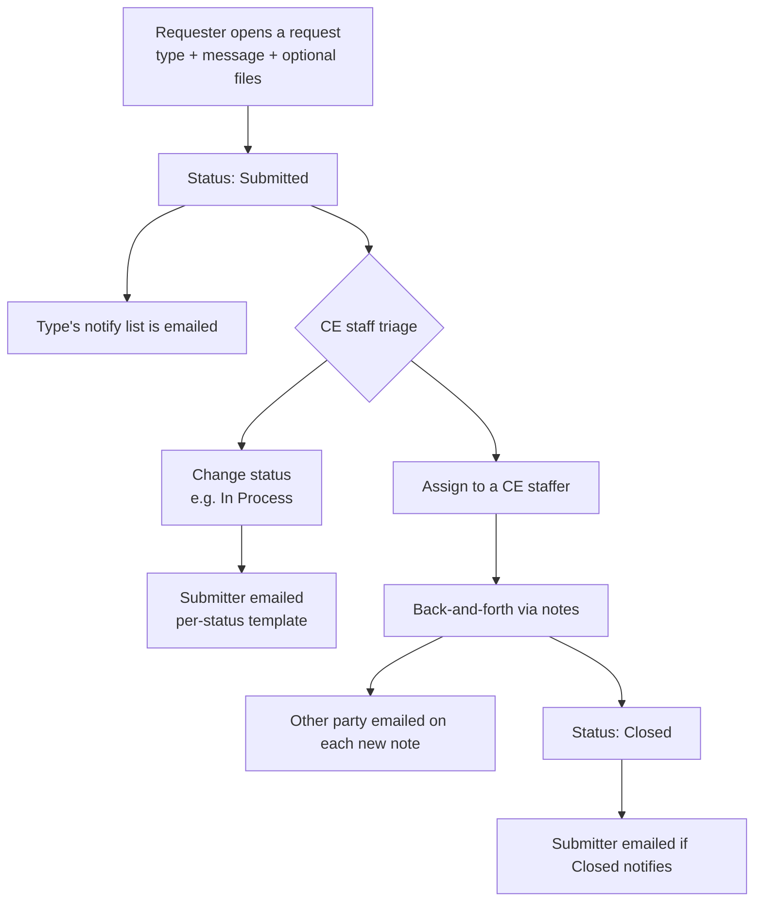

# Support Requests

## Overview

Support Requests is MyCE's built-in help-desk. Students, instructors, and high-school
administrators open requests to the Concurrent Enrollment (CE) office; CE staff triage, assign,
respond, and resolve them. Each request has a **type**, a **status**, an optional set of **file
attachments**, and a running thread of **notes**. Email notifications keep everyone in the loop,
and CE staff get filtering, export, bulk actions, and an at-a-glance dashboard.

Nothing needs to be installed by the end user — Support Requests appears in the left sidebar for
each role that is allowed to use it.

## Who uses it

| Role | Can do | Where |
|------|--------|-------|
| **Student** | Open requests, attach files, view their own requests, reply with notes | Student portal → **Support Requests** |
| **Instructor** | Open requests, attach files, view their own, reply | Instructor portal → **Support Requests** |
| **High School Administrator** | Open requests, view requests from their high school, reply | HS Admin portal → **Support Requests** |
| **CE Staff** | See all requests, assign, change status, reply (public or internal notes), bulk-update, export, view the summary dashboard, manage request types and settings | CE portal → **Support Requests** |

Each requester only ever sees **their own** requests (high-school administrators see requests from
people at their high school). CE staff see everything.

## Request lifecycle

Statuses are **configurable** (see *Settings*). Out of the box they are **Submitted → Pending →
Closed**; an administrator can rename them, add new ones, or change which statuses send an email.

## Submitting a request

1. Open **Support Requests** in your portal and click **New Request**.
2. Pick a **Request Type** (only the types meant for your role are listed).
3. Enter your message.
4. Attach one or more files if needed. Some request types **require** at least one attachment — if
   so, you'll be asked to add one before you can submit.
5. Submit. You'll see your request in the list with status **Submitted**, and the CE office is
   notified automatically.

To continue a conversation, open the request and add a **note** (and optionally attach files). The
other party is emailed when a note is added.

## Managing requests (CE staff)

The CE **Support Requests** page is a searchable table with two tabs: **Requests** and **Summary**.

- **Filter** by **Status** and by **Assigned To** to narrow the list.
- **Export** the current view to **CSV** or **PDF**.
- **Open** any request in a pop-up to read the thread, assign it, change its status, and reply.
- **Notes** can be **Public** (visible to the requester and emailed to them) or **Internal**
  (CE-only — never shown or emailed to the requester).
- **Bulk actions:** select multiple rows, then **Update Status** or **Update Assigned To** to apply
  one change to all selected requests at once.

> Bulk status/assignment changes update the selected requests directly and do **not** send the
> per-status emails (to avoid an email storm). Status changes made one request at a time from the
> request's page **do** send the configured email.

### Summary dashboard

The **Summary** tab shows charts of open work — counts of requests **by status**, **by type**, and
**by assignee** — so the CE office can see the queue at a glance.

## Request types

A **Request Type** is a category a requester chooses when opening a request. CE staff manage types
from the CE Support Requests area. Each type has:

| Setting | Meaning |
|---------|---------|
| **Name** | What the requester sees in the dropdown (e.g. "Transcript question") |
| **Applies to** | Which audience can pick it: **Students**, **Instructors**, or **High School Administrators** |
| **Default assignee** | A CE staffer automatically assigned to new requests of this type |
| **Notify** | CE users and/or extra email addresses notified when a request of this type is submitted |
| **Requires attachment** | If on, the requester must attach at least one file to submit |

## Settings

CE administrators configure Support Requests under **Settings → Misc. → Support Ticket Settings**.

| Setting | What it controls |
|---------|------------------|
| **Active** | `Active` = emails send normally; `Off` = no emails; `Debug` = emails redirect to the test recipients only |
| **Who can start requests** | Which roles (students / instructors / high-school administrators) may open new requests. Roles that can't start requests won't see a **New Request** button |
| **Statuses** | The list of statuses (one per line; the first line is the status applied to new requests) |
| **Per-status email** | For each status: whether entering it emails the submitter, plus the subject and message template |
| **Submission email** | Subject + message sent to a type's notify list when a request is submitted |
| **Note email** | Subject + message sent to the other party when a note is added |
| **Default recipients** | Fallback addresses used when a request has no assignee |
| **Sender address** | The "from" address on Support Request emails |

Email templates support shortcodes (e.g. `{{first_name}}`, `{{status}}`, `{{ticket_type}}`,
`{{update}}`, `{{site_url}}`) that are filled in per request.

> **Emails are queued.** Support Request emails are sent through the mail queue, not instantly in
> the browser — they go out as the queue is processed.

## Reports

CE staff can download **Support Ticket Types – Export** (CSV) from the **Reports** area to get every
request type with its audience, default assignee, notify list, and required-attachment flag.

## Where to find it

| Audience | Location |
|----------|----------|
| CE staff | CE portal → **Support Requests** (`/ce/support_reqs/`) |
| Students | Student portal → **Support Requests** (`/student/support_requests/`) |
| Instructors | Instructor portal → **Support Requests** (`/instructor/support_requests/`) |
| High-school admins | HS Admin portal → **Support Requests** (`/highschool_admin/support_requests/`) |
| Settings | CE portal → **Settings → Misc. → Support Ticket Settings** |

## Key Files

For administrators and developers — the feature ships as the `support_ticket` package
(`Canusia/package-support_ticket`); see its `README.md` (install/wiring) and `docs/TECHNICAL.md`
(architecture) for the full technical reference.

| File / location | Purpose |
|-----------------|---------|
| `support_ticket` package | The app: models, portals, settings, signals, DRF API, report, dashboard |
| `webapp/cis/settings/menu.py` + `cis` migration `0064` | Surfaces **Support Requests** in each role's sidebar nav |
| `webapp/cis/views/faculty.py` / portals' `views/` | Per-portal request pages |

## Troubleshooting

| Issue | Cause | Resolution |
|-------|-------|------------|
| A user doesn't see **Support Requests** in the sidebar | Their role isn't enabled, or the nav wasn't refreshed | Confirm the role is allowed under **Who can start requests**; ensure the nav update ran for the site |
| **New Request** button is missing | The role is turned off under **Who can start requests** | Enable that role in **Support Ticket Settings** |
| Can't submit — "attachment required" | The selected request type has **Requires attachment** on | Attach at least one file, or pick a type that doesn't require one |
| Requester can't see a CE reply in-portal | The note was marked **Internal** | Use a **Public** note for replies the requester should see |
| No emails are going out | **Active** is set to `Off` (or `Debug`), or the mail queue isn't being processed | Set **Active** to `Active`; confirm the mail queue is running |
| Emails go to the wrong place | **Active** is `Debug` (redirects to test recipients) | Switch **Active** to `Active` for production |
| A request type isn't offered to a user | The type's **Applies to** doesn't match the user's role | Set the type's **Applies to** to that audience |
| Bulk status change didn't email submitters | By design — bulk changes are silent | Change status from the individual request page to send the per-status email |
